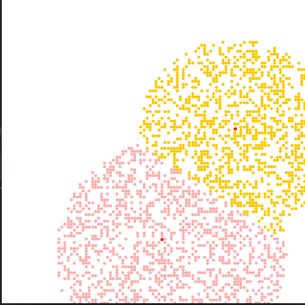
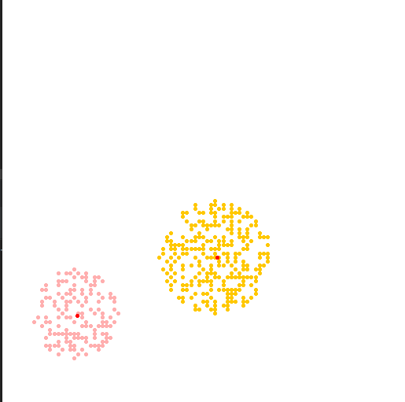
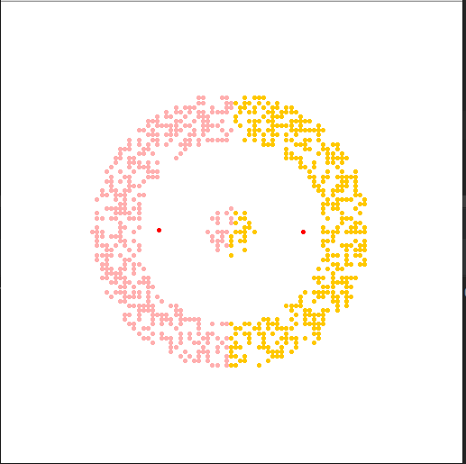

# Кластеринг k-means
### Входные данные
Случайно сгенерированные точки на плоскости
### Задача
С помощью кластеринга k-means требуется отсортировать данные
### Анализ адекватности k-means
Пример со случайными точками на плоскости прошел безуспешно потому что k-means не предназначен для такого типа информации

Чем четче разграничены кластеры, тем соответственно лучше работает k-means

Это лучше всего видно на 3 примере

Хотя существуют и исключения, которые устраняются изменением параметров k-means

